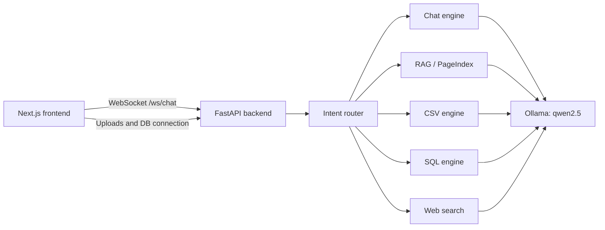

# SLM-AI

SLM-AI is a local enterprise AI copilot with a Next.js frontend and a FastAPI backend. It routes each request to the most appropriate engine and uses a local Ollama model to generate responses.

The application can:

- Answer normal conversational questions.
- Search uploaded PDF, DOCX, and TXT files with retrieval-augmented generation (RAG).
- Build a PageIndex tree for structured PDFs with three or more pages.
- Analyze uploaded CSV and XLSX files.
- Query a connected SQLAlchemy-compatible database using role-based table access.
- Search the live web when explicitly requested.
- Draft emails and generate PDF reports from chat requests.

## Architecture



The frontend connects to `http://localhost:8000` and `ws://localhost:8000/ws/chat` by default. The backend connects to Ollama at `http://localhost:11434/api/generate` and uses the `qwen2.5` model.

## Requirements

- Windows, macOS, or Linux
- Python 3.13 or newer
- Node.js with pnpm
- Ollama with the `qwen2.5` model
- A database connection string when using the SQL engine

Install Ollama from [ollama.com](https://ollama.com), then download the configured model:

```bash
ollama pull qwen2.5
```

Ollama must be running before you send chat requests. Its default local address is used by the backend.

## Quick Start

### 1. Start the backend

From the repository root:

```powershell
cd backend
py -3.13 -m venv .venv
.\.venv\Scripts\Activate.ps1
python -m pip install --upgrade pip
python -m pip install -e .
python -m uvicorn app.main:app --reload --host 0.0.0.0 --port 8000
```

On macOS or Linux, activate the environment with:

```bash
source .venv/bin/activate
```

The API will be available at `http://localhost:8000`. FastAPI's interactive documentation is available at `http://localhost:8000/docs`.

### 2. Start the frontend

Open a second terminal at the repository root:

```bash
cd frontend
pnpm install
pnpm dev
```

Open the URL printed by Next.js, normally `http://localhost:3000`.

For a production frontend build:

```bash
cd frontend
pnpm build
pnpm start
```

## Using the Application

1. Sign in with one of the demo users below.
2. Ask a question in the chat box. The backend sends the request through the routing agent.
3. Upload a file with the plus button beside the message box:
	 - `.pdf`, `.docx`, `.txt`: indexed for document search.
	 - `.csv`, `.xlsx`: loaded into the spreadsheet analysis engine.
4. For a PDF with at least three pages, choose whether to build a PageIndex for section-aware retrieval.
5. To use SQL analysis, enter a SQLAlchemy connection URL in the sidebar and connect the database.

The router recognizes the following intents:

| Intent | Used for |
| --- | --- |
| `CHAT` | General questions, drafting, coding, and conversation |
| `RAG` | Uploaded documents and knowledge-base questions |
| `CSV` | Uploaded spreadsheet analysis |
| `SQL` | Questions about a connected database |
| `WEB` | Explicit requests for current internet information |

## Demo Users

The login screen reads users from `backend/data/users.json`.

| Username | Password | Role |
| --- | --- | --- |
| `intern1` | `password123` | `Standard_User` |
| `hr_manager` | `password123` | `HR_User` |
| `cfo` | `admin` | `Admin` |

These credentials are for local demonstration only. Do not use them in a deployed environment.

## Role-Based Database Access

When a database is connected, the SQL engine limits the visible tables by role:

| Role | Allowed tables |
| --- | --- |
| `Standard_User` | `events`, `rooms` |
| `HR_User` | `event_registrations`, `room_bookings`, `profiles` |
| `Admin` | All tables |

Generated SQL is restricted to read operations. Queries containing `DROP`, `DELETE`, `UPDATE`, or `INSERT` are rejected.

## API Overview

| Method | Path | Purpose |
| --- | --- | --- |
| `POST` | `/login` | Authenticate a demo user |
| `POST` | `/chat` | Stream a chat response over HTTP |
| `POST` | `/upload_document` | Ingest PDF, DOCX, or TXT files |
| `POST` | `/upload_file` | Ingest CSV or XLSX files |
| `POST` | `/enable_pageindex` | Build a structured index for an uploaded document |
| `POST` | `/connect_db` | Connect a SQLAlchemy-compatible database |
| `POST` | `/send-email` | Send an email action for authorized roles |
| `POST` | `/generate-pdf` | Generate and download a PDF report |
| `POST` | `/ingest` | Ingest files from the backend data directory |
| `WebSocket` | `/ws/chat` | Stream the frontend chat experience |

## Repository Layout

```text
backend/
	app/
		main.py                 FastAPI app and HTTP/WebSocket endpoints
		engine/
			model.py              Ollama client
			router.py             Document retrieval mode selection
			rag.py                FAISS-based document retrieval
			pageindex.py          Structured PDF indexing and retrieval
			sql_engine.py         Database connection, SQL generation, and RBAC
			tabular_engine.py     CSV/XLSX ingestion and analysis
	data/                     Demo data, indexes, metrics, and uploads
	pyproject.toml            Python project and dependency configuration

frontend/
	app/                      Next.js routes and global styles
	components/
		chat-interface.tsx      WebSocket chat UI and file upload flow
		data-sidebar.tsx        Database connection UI
		login.tsx               Demo login screen
		ui/                     Reusable UI components
	package.json              Frontend scripts and dependencies
```

## Development Notes

- The backend stores uploaded files under `backend/data/uploads/`.
- Retrieval indexes and SQL telemetry are also written under `backend/data/`.
- The backend uses open CORS settings for local development. Restrict `allow_origins` before deployment.
- Email delivery is currently a stub: `/send-email` logs the email and returns success; it does not contact an SMTP provider.
- Login credentials are stored as plain text in `backend/data/users.json` for the demo and are not suitable for production authentication.
- The frontend currently assumes the backend is running on `localhost:8000`; update the fetch and WebSocket URLs before deploying to another host.
- No automated test suite is currently configured. Validate changes by running the backend, frontend lint/build commands, and the relevant workflow manually.

## Useful Commands

```bash
# Backend syntax/import check
cd backend
python -m compileall app

# Frontend lint
cd frontend
pnpm lint

# Frontend production build
pnpm build
```

## License

No license file is currently included in this repository.
